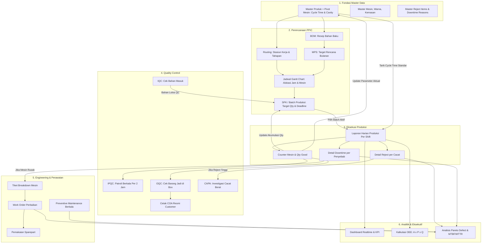
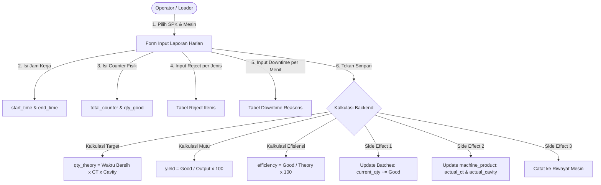
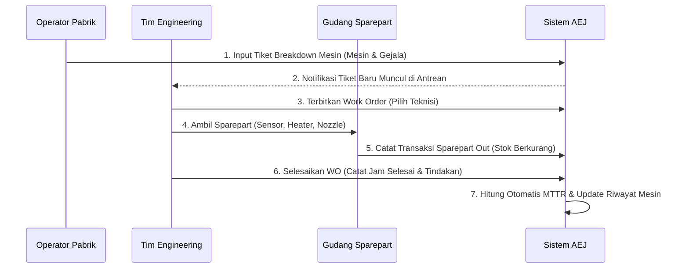

# Panduan Lengkap Arsitektur Menu, Kebutuhan Data, dan Arus Transaksi
### Sistem ERP Manufaktur Terintegrasi — AEJ Manufactra

Dokumen ini adalah spesifikasi teknis dan operasional menyeluruh mengenai seluruh **7 Modul Utama** dan **37 Submenu** di sistem AEJ Manufactra. Setiap menu diuraikan berdasarkan:
1. **Fungsi & Aturan Bisnis (Business Rules & Validasi)**
2. **Kebutuhan Data Input & Prasyarat (Input Dependencies)**
3. **Data Keluar (Output) & Dampak Otomatis ke Modul Lain (Side Effects)**

---

## DAFTAR ISI
1. [Peta Alur Data Transaksi Manufaktur](#1-peta-alur-data-transaksi-manufaktur)
2. [Modul 1: Dashboard & Audit](#modul-1-dashboard--audit)
3. [Modul 2: PPIC (Perencanaan & Pengendalian Produksi)](#modul-2-ppic-perencanaan--pengendalian-produksi)
4. [Modul 3: Produksi (Eksekusi Shop Floor)](#modul-3-produksi-eksekusi-shop-floor)
5. [Modul 4: Quality Control (QC)](#modul-4-quality-control-qc)
6. [Modul 5: Engineering & Maintenance](#modul-5-engineering--maintenance)
7. [Modul 6: Master Data](#modul-6-master-data)
8. [Modul 7: Pengaturan Sistem & Keamanan](#modul-7-pengaturan-sistem--keamanan)
9. [Matriks Otorisasi Hak Akses Role](#matriks-otorisasi-hak-akses-role)

---

## 1. Peta Alur Data Transaksi Manufaktur

Berikut adalah siklus keterhubungan data end-to-end dalam pabrik:

---

## Modul 1: Dashboard & Audit

### 1.1. Dashboard Utama
* **Route:** `dashboard` (`/dashboard`)
* **Penanggung Jawab:** Seluruh Staf, SPV, Manager, Direksi.

#### A. Kebutuhan Data Input
* Filter tanggal: `start_date` dan `end_date` (default: 7 hari terakhir / bulan berjalan).
* Filter opsional: `product_id` (spesifik produk tertentu).

#### B. Aturan Bisnis & Rumus Kalkulasi
* **Kalkulasi Target Teoritis Dinamis:** Sistem tidak hanya menjumlahkan kolom `qty_theory`, melainkan menghitung ulang secara presisi dengan menggabungkan waktu kerja bersih dan standar mesin:
  $$\text{Target Qty} = \left\lfloor \frac{(\text{Total Menit} - \text{Downtime}) \times 60}{\text{Standard Cycle Time}} \right\rfloor \times \text{Cavity}$$
* **Achievement (%):** $(\text{Total Output} / \text{Total Target}) \times 100\%$
* **Yield (%):** $(\text{Qty Good} / \text{Total Output}) \times 100\%$
* **Efisiensi (%):** $(\text{Qty Good} / \text{Total Target}) \times 100\%$

#### C. Data Keluar (Output) & Dampak Sistem
* **Output:** Card KPI Ringkasan (Total Output, Total Reject, Total Good, Akumulasi Target, Rata-rata Yield & Efisiensi).
* **Grafik:** Tren produksi harian, distribusi jam kerja, dan diagram Pareto cacat tertinggi.
* **Fitur Ekspor:** Download laporan ringkasan dalam format Excel (`.xlsx`) dan PDF siap cetak.

---

### 1.2. Log Aktivitas
* **Route:** `activity-logs.index` (`/activity-logs`)
* **Penanggung Jawab:** Super Admin & Auditor Internal.

#### A. Kebutuhan Data Input
* Filter berdasarkan `event` (created, updated, deleted), nama user, atau rentang waktu.

#### B. Aturan Bisnis
* Hanya dapat diakses oleh role `super_admin` dan `admin`.
* Seluruh log bersifat **Immutable** (hanya bisa dibaca / Read-Only, tidak ada tombol edit atau hapus manual demi integritas data audit).

#### C. Data Keluar & Dampak Sistem
* Menampilkan rekaman *diff* audit: nilai kolom sebelum diubah (`old`) vs sesudah diubah (`attributes`).

---

## Modul 2: PPIC (Perencanaan & Pengendalian Produksi)

### 2.1. Master Production Schedule (MPS)
* **Route:** `mps.index` (`/ppic/mps`)
* **Model:** `ProductionPlan`, `ProductionPlanItem`

#### A. Kebutuhan Data Input
| Field Input | Tipe Data | Wajib | Keterangan |
| :--- | :--- | :---: | :--- |
| `plan_code` | String | Ya | Kode rencana produksi (contoh: `MPS-2026-09`) |
| `plan_month` & `year` | Integer | Ya | Periode bulan dan tahun perencanaan |
| `product_id` | Foreign Key | Ya | Produk yang akan diproduksi (harus ada di Master Produk) |
| `planned_quantity` | Integer | Ya | Target total pcs yang harus diproduksi |

#### B. Aturan Bisnis & Arus Data
* MPS menjadi dasar penghitungan kebutuhan bahan mentah (MRP) dan alokasi kapasitas mesin (CRP).
* Tidak dapat ditutup jika ada item yang belum dialokasikan ke jadwal produksi.

---

### 2.2. Jadwal Produksi (Schedule Board / Gantt Chart)
* **Route:** `schedule.index` (`/ppic/schedule`)
* **Penanggung Jawab:** Staff PPIC & Koordinator Produksi.

#### A. Kebutuhan Data Input
* Drag & Drop batch dari daftar *Unscheduled Batches* ke garis waktu Vis.js Timeline.
* Parameter: `work_center_id`, `planned_start` (datetime), `planned_end` (datetime), `visual_color` (hex warna).

#### B. Aturan Bisnis & Dampak Sistem
* Mengupdate kolom `planned_start` dan `planned_end` pada tabel `batches`.
* Mencegah tumpang tindih waktu (double-booking) pada stasiun kerja/mesin yang sama.

---

### 2.3. SPK / Batch Produksi
* **Route:** `batches.index` (`/batches`)
* **Model:** `Batch`

#### A. Kebutuhan Data Input
| Field Input | Tipe Data | Wajib | Keterangan |
| :--- | :--- | :---: | :--- |
| `batch_code` | String | Ya | Nomor unik SPK (contoh: `EKDEV-070926-001`) |
| `product_id` | Foreign Key | Ya | Produk target |
| `color_id` | Foreign Key | Ya | Varian warna produk |
| `machine_id` | Foreign Key | Opsional | Mesin yang dialokasikan |
| `target_quantity` | Integer | Ya | Target pcs yang diproduksi |
| `start_date` & `deadline_date` | Date | Ya | Tanggal mulai dan batas waktu penyelesaian |
| `priority` | Enum | Ya | `low`, `medium`, `high` |

#### B. Aturan Bisnis & Dampak Sistem
* **Proteksi Hapus:** Batch yang sudah memiliki histori transaksi di `daily_reports` **dilarang dihapus** (mencegah error SQL Foreign Key 1451).
* **Auto-Completion:** Jika akumulasi `current_quantity >= target_quantity`, sistem otomatis mengubah status batch menjadi `completed`.
* **Locking Batch:** Batch berstatus `completed` atau `canceled` otomatis terkunci agar operator tidak salah memilih batch yang sudah selesai.
* **Toggle Active:** Mengaktifkan/menonaktifkan batch agar hanya batch berjalan yang muncul di dropdown laporan harian.
* **Output:** Label SPK ber-QR Code untuk ditempel pada papan informasi mesin.

---

### 2.4. Bill of Materials (BOM)
* **Route:** `bom.index` (`/ppic/bom`)
* **Model:** `BillOfMaterial`, `RawMaterial`

#### A. Kebutuhan Data Input
* Pemilihan Produk target (`product_id`).
* Komponen bahan baku (`raw_material_id`), rasio kebutuhan (`quantity` per pcs produk jadi), dan satuan ukur (`unit`: kg, gram, pcs).

#### B. Aturan Bisnis
* 1 Produk dapat memiliki multi-komponen bahan baku (misal: 98% Resin Polypropylene + 2% Masterbatch Pewarna).
* Menjadi acuan modul Quality Control (IQC) saat memverifikasi bahan yang datang dari vendor.

---

### 2.5. Production Routing
* **Route:** `routing.index` (`/ppic/routing`)
* **Model:** `ProductRouting`, `WorkCenter`

#### A. Kebutuhan Data Input
* `product_id`, `work_center_id`, `step_order` (urutan tahap: 1, 2, 3..), `process_name` (contoh: Mixing, Molding, Trimming, Packing), `cycle_time` standar stasiun, dan `setup_time`.

#### B. Aturan Bisnis
* Mendefinisikan jalur pergerakan barang setengah jadi (WIP) antar stasiun kerja pabrik.

---

## Modul 3: Produksi (Eksekusi Shop Floor)

### 3.1. Laporan Harian Produksi (Daily Report)
* **Route:** `daily-reports.index` (`/daily-reports`)
* **Model Utama:** `DailyReport`, `DailyReportReject`, `DailyReportDowntime`

#### A. Kebutuhan Data Input Lengkap
| Parameter Input | Tipe Data | Sumber / Prasyarat | Keterangan |
| :--- | :--- | :--- | :--- |
| `production_date` | Date | Input User | Tanggal operasional kerja |
| `batch_id` | Foreign Key | Master Batch | SPK aktif yang sedang dikerjakan |
| `machine_id` | Foreign Key | Master Mesin | Mesin tempat produksi berlangsung |
| `shift_id` | Foreign Key | Master Shift | Shift 1, 2, atau 3 |
| `coordinator_id` | Foreign Key | Master Koordinator | Koordinator / Leader penanggung jawab |
| `operator_id` | Foreign Key | Master Operator | Operator yang bertugas |
| `start_time` & `end_time` | Time | Jam Mesin | Durasi jam kerja shift |
| `actual_cycle_time` | Decimal | Stop watch / Mesin | Waktu siklus aktual saat produksi berjalan (detik) |
| `actual_cavity` | Integer | Cetakan Fisik | Jumlah cavity cetakan yang aktif |
| `total_counter` | Integer | Counter Fisik | Angka meteran/counter mesin saat akhir shift |
| `qty_good` | Integer | Timbangan / Hitung | Jumlah produk lolos sortasi (pcs) |
| `qty_sample` | Integer | QC Sample | Jumlah produk yang diambil sampel oleh QC |
| `total_runner` | Decimal (Kg) | Timbangan | Total berat runner / tangkai plastik |
| `purging_kg` | Decimal (Kg) | Timbangan | Total berat plastik sisa purging mesin |
| `wip_previous` & `wip` | Integer | Hitungan Shift | Stok setengah jadi shift lalu & sisa shift ini |
| `rejects[]` | Array of Objects | Master Reject | Daftar reject item beserta kuantiti afkir per jenis |
| `downtimes[]` | Array of Objects | Master Downtime | Daftar penyebab henti mesin beserta durasi menit mati |

#### B. Rumus Otomatis & Logika Backend
1. **Total Waktu Kerja (Menit):**
   $$\text{Total Menit} = \text{Selisih Waktu}(\text{start\_time}, \text{end\_time})$$
   *(Jika melewati tengah malam, otomatis ditambahkan 24 jam).*
2. **Waktu Bersih (Menit Efektif):**
   $$\text{Effective Minutes} = \max(0, \text{Total Menit} - \sum \text{Downtime})$$
3. **Total Output Fisik:**
   $$\text{Total Output} = \text{Qty Good} + \sum \text{Qty Reject}$$
4. **Target Qty Teoritis:**
   $$\text{Qty Theory} = \left\lfloor \frac{\text{Effective Minutes} \times 60}{\text{Standard CT}} \right\rfloor \times \text{Actual Cavity}$$
5. **Yield Mutu (%):** $(\text{Qty Good} / \text{Total Output}) \times 100\%$
6. **Efisiensi Produksi (%):** $(\text{Qty Good} / \text{Qty Theory}) \times 100\%$ *(maks. 999.99)*

#### C. Dampak Sistem Otomatis (Side Effects)
* **Ke Tabel `batches`:** Menambahkan `current_quantity += Qty Good` dan `reject_quantity += Total Reject`.
* **Ke Tabel Pivot `machine_product`:** Memperbarui parameter historis mesin: `actual_cycle_time` dan `actual_cavity`.
* **Locking Laporan:** Laporan yang berumur lebih dari 24 jam otomatis terkunci dan hanya bisa diedit oleh Super Admin / Admin Produksi.

---

### 3.2. Monitoring Produksi & Andon Digital
* **Route:** `monitoring-produksi.index` & `andon.index`
* **Arus Data:** Mengambil data real-time per mesin hari ini.
* **Tampilan:**
  * Hijau (*Running*): Ada input counter aktif dan tidak ada downtime aktif.
  * Merah (*Trouble/Breakdown*): Terdapat laporan downtime kategori mesin breakdown.
  * Kuning (*Hold/Idle*): Sedang menunggu bahan atau ganti setup cetakan.

---

### 3.3. OEE Dashboard & Downtime Tracking
* **Route:** `oee-dashboard.index` & `downtime-tracking.index`
* **Arus Data:**
  * Memproses seluruh akumulasi downtime dari tabel `daily_report_downtimes`.
  * Menghitung nilai **Availability**, **Performance**, dan **Quality** untuk menghasilkan skor **OEE Standard Dunia (Benchmark 85%)**.
  * Menghasilkan Diagram Pareto 80/20 penyebab kerugian jam kerja mesin terbesar.

---

## Modul 4: Quality Control (QC)

### 4.1. IQC (Incoming Quality Control)
* **Route:** `iqc.index` (`/qc/iqc`)
* **Kebutuhan Data Input:** Nomor PO/Lot kedatangan, `raw_material_id`, nama supplier, tanggal cek, ukuran sampel, parameter teknis (kadar air, warna, melt flow index), dan status kelulusan (`pass`, `reject`, `hold`).
* **Arus Data:** Bahan baku yang berstatus `pass` otomatis tersedia di gudang untuk diolah pada batch SPK.

---

### 4.2. IPQC (In-Process Quality Control)
* **Route:** `ipqc.index` (`/qc/ipqc`)
* **Kebutuhan Data Input:** `batch_id`, `machine_id`, jam patroli, hasil cek dimensi, berat timbangan per pcs (gram), checklist cacat visual (sink mark, short shot, flash, silver streak).
* **Arus Data:** Memberikan alert langsung jika berat produk menyimpang dari berat master produk di database. Jika ditemukan NG berulang, sistem merekomendasikan penerbitan tiket CAPA.

---

### 4.3. OQC & Sertifikat Analisis (COA)
* **Route:** `oqc.index` & `coa.index`
* **Kebutuhan Data Input:** `batch_id`, sampling kuantiti box, nomor sertifikat `coa_number`, nama customer penerima, dan tabel parameter uji mutu (Standar vs Hasil Uji).
* **Arus Data:**
  * Status OQC menentukan apakah barang jadi di gudang boleh dikirim (status: *Released*).
  * Menghasilkan file PDF Certificate of Analysis resmi bertanda tangan digital QC Manager untuk diserahkan ke pelanggan.

---

## Modul 5: Engineering & Maintenance

### 5.1. Breakdown Mesin & Work Order (WO)
* **Route:** `breakdown.index` & `work-order.index`
* **Kebutuhan Data Input:**
  * Tiket Kerusakan: `machine_id`, uraian masalah, tingkat keparahan (*Low, Medium, High, Critical*).
  * Work Order: Nama teknisi penanggung jawab, jam mulai & jam selesai, tindakan perbaikan, serta daftar suku cadang yang digunakan.
* **Arus Data:** Jam mati mesin otomatis tersinkronisasi ke laporan downtime harian, mencegah perselisihan data antara tim produksi dan tim mekanik.

---

### 5.2. Preventive Maintenance (PM) & Riwayat Mesin
* **Route:** `preventive.index` & `machine-history.index`
* **Kebutuhan Data Input:** Jadwal checklist servis berkala per mesin (harian, mingguan, bulanan, tahunan).
* **Arus Data:**
  * Mengakumulasi riwayat perbaikan mesin sepanjang masa pakainya (*Machine Lifecycle*).
  * Menghitung otomatis indikator keandalan mesin:
    * **MTBF (*Mean Time Between Failures*):** Rata-rata jam operasional mesin antar kerusakan.
    * **MTTR (*Mean Time To Repair*):** Rata-rata durasi yang dibutuhkan teknisi untuk menyelesaikan perbaikan mesin.

---

### 5.3. Manajemen Sparepart
* **Route:** `sparepart.index` (`/engineering/sparepart`)
* **Kebutuhan Data Input:** Kode part, nama komponen, lokasi rak, stok fisik saat ini, batas minimum stok (*reorder point*), dan riwayat transaksi barang masuk/keluar.
* **Arus Data:** Setiap pemakaian suku cadang di Work Order otomatis memotong saldo stok sparepart dan memunculkan peringatan jika stok berada di bawah batas aman.

---

## Modul 6: Master Data

Master data adalah tabel referensi tunggal (*Single Source of Truth*) yang wajib diisi terlebih dahulu sebelum proses transaksi pabrik dimulai:

| Nama Menu | Kebutuhan Data Input Utama | Aturan Khusus & Proteksi Sistem |
| :--- | :--- | :--- |
| **Data Produk** (`products.index`) | Kode produk, nama barang, jenis kemasan, berat standar (gram), isi per kardus, dan pairing mesin (Cycle Time & Cavity standar). | **Pivoting Mesin:** 1 produk bisa diproduksi di beberapa mesin dengan cycle time dan cavity yang berbeda-beda. |
| **Data Mesin** (`machines.index`) | Nama/nomor mesin, merk, kapasitas tonase, status aktif/nonaktif. | Mesin yang dinonaktifkan tidak akan muncul di form laporan harian. |
| **Data Warna** (`colors.index`) | Kode warna, nama warna (Putih, Natural, Hitam, Merah, dll). | Digunakan untuk tracking varian batch produksi. |
| **Jenis Kemasan** (`packaging-types.index`) | Nama kemasan (Kardus Standar, Karung Plastik, Tray Box). | Menentukan metode perhitungan jumlah koli barang jadi. |
| **Reject Items** (`reject-items.index`) | Kategori cacat (Proses, Material, Setting) dan nama cacat (Flash, Short Shot, Belang, Baret). | Menjadi pilihan multi-input pada laporan reject harian. |
| **Data Downtime** (`downtimes.index`) | Kategori henti (Terschedule vs Tak Terschedule) dan nama alasan stop (Ganti Cetakan, Setting Awal, Bahan Habis, Trouble). | Menjadi dasar analisis pareto dan pengurangan jam target produksi. |
| **Data Shift** (`shifts.index`) | Nama shift, jam mulai kerja, dan jam selesai kerja. | Menentukan validasi waktu absensi dan laporan per regu. |
| **Data Koordinator** (`coordinators.index`) | Nama pengawas/supervisor lantai pabrik. | PIC penanggung jawab lembar laporan per shift. |
| **Data Operator** (`operators.index`) | Nama operator pelaksana mesin. | Penanggung jawab fisik pengoperasian mesin. |

> [!IMPORTANT]
> Seluruh Master Data dilengkapi dengan fitur **Download Template Excel**, **Import Excel Massal**, **Export Data**, dan **Toggle Status Aktif**. Seluruh master data dilindungi oleh aturan integritas relasional database sehingga data yang sedang terikat pada transaksi tidak dapat dihapus sembarangan.

---

## Modul 7: Pengaturan Sistem & Keamanan

### 7.1. Manajemen Pengguna (User Management)
* **Route:** `users.index` (`/users`)
* **Kebutuhan Data Input:** Nama lengkap, email unik perusahaan, password (min. 6 karakter), role hak akses, dan status akun (`active`/`inactive`).
* **Aturan Bisnis:**
  * Password otomatis dienkripsi menggunakan algoritma satu arah **Bcrypt**.
  * Pengguna nonaktif otomatis ditolak saat mencoba login.
  * Akun ber-role `super_admin` dilindungi dan tidak dapat dihapus oleh role di bawahnya.

---

### 7.2. Konfigurasi Akses Menu
* **Route:** `settings.menus.index` (`/menus`)
* **Kebutuhan Data Input:** Matriks checklist interaktif per baris menu dan per kolom role.
* **Aturan Bisnis & Arus Data:**
  * Menghapus dan menulis ulang record di tabel `menu_access`.
  * Perubahan langsung aktif secara *real-time* saat halaman di-refresh tanpa perlu restart server.
  * Jika menu utama (Parent) tidak dicentang, maka seluruh submenu di dalamnya otomatis tidak akan ditampilkan di sidebar user tersebut.

---

### 7.3. Lock System (Emergency Maintenance Mode)
* **Route:** `system.toggle-lock`
* **Aturan Bisnis:**
  * Tombol darurat khusus Super Admin untuk membekukan akses aplikasi.
  * Membuat file flag `system_locked` di server.
  * Seluruh user selain Super Admin yang sedang aktif akan langsung diblokir ke halaman layar maintenance HTTP 503 saat membuka halaman apapun.

---

## Matriks Otorisasi Hak Akses Role

Tabel berikut menunjukkan hak akses bawaan sistem untuk setiap role karyawan:

| Modul & Fitur | Super Admin | Admin PPIC / Produksi | GM / Manager | SPV Lapangan | Leader Shift | Operator Mesin |
| :--- | :---: | :---: | :---: | :---: | :---: | :---: |
| **Dashboard KPI Eksekutif** | ✅ Penuh | ✅ Penuh | ✅ Lihat | ✅ Lihat | ✅ Lihat | ✅ Lihat |
| **Log Aktivitas Audit** | ✅ Penuh | ✅ Penuh | ❌ | ❌ | ❌ | ❌ |
| **Perencanaan PPIC (MPS, Jadwal, SPK, BOM)** | ✅ Penuh | ✅ Kelola | ✅ Lihat | ✅ Lihat | ❌ | ❌ |
| **Laporan Harian Produksi (Input & Review)** | ✅ Penuh | ✅ Verifikasi | ✅ Lihat | ✅ Verifikasi | ✅ Input Shift | ✅ Input Shift |
| **Analisis OEE, Target & Downtime** | ✅ Penuh | ✅ Penuh | ✅ Lihat | ✅ Lihat | ✅ Pantau | ❌ |
| **Inspeksi QC (IQC, IPQC, OQC, COA)** | ✅ Penuh | ✅ Kelola | ✅ Lihat | ✅ Kelola | ❌ | ❌ |
| **Engineering (Breakdown, WO, PM, Sparepart)**| ✅ Penuh | ✅ Kelola | ✅ Lihat | ✅ Kelola | ❌ | ❌ |
| **Master Data (Produk, Mesin, Cacat, dll)** | ✅ Penuh | ✅ Kelola | ✅ Lihat | ✅ Lihat | ❌ | ❌ |
| **Manajemen User & Akses Menu** | ✅ Penuh | ❌ | ❌ | ❌ | ❌ | ❌ |
| **Kunci Sistem Darurat (Lock System)** | ✅ Penuh | ❌ | ❌ | ❌ | ❌ | ❌ |
